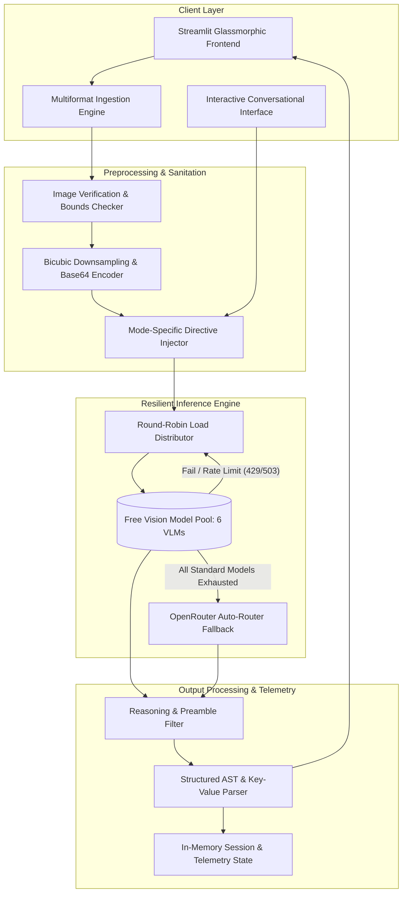

# VisionAI: Multimodal Visual Intelligence & Analysis Studio

[](https://www.python.org/)
[](https://streamlit.io/)
[](https://openrouter.ai/)
[](https://opensource.org/licenses/MIT)
[](https://pep8.org/)

VisionAI is an enterprise-grade visual intelligence platform designed for comprehensive image understanding, structured data extraction, and interactive visual reasoning. Powered by an ensemble of state-of-the-art vision-language models (VLMs) orchestrated through OpenRouter, VisionAI combines specialized analysis pipelines with an automated high-availability failover engine and a modern glassmorphic interface.

---

## Table of Contents

- [Executive Summary](#executive-summary)
- [System Architecture](#system-architecture)
- [Operational Workflow](#operational-workflow)
- [Core Capabilities & Analysis Engines](#core-capabilities--analysis-engines)
- [Model Orchestration & Fault Tolerance](#model-orchestration--fault-tolerance)
- [User Interface & Design System](#user-interface--design-system)
- [Repository Structure](#repository-structure)
- [Installation & Setup](#installation--setup)
- [Configuration & Environment Variables](#configuration--environment-variables)
- [Deployment Guide](#deployment-guide)
- [Security & Resource Specifications](#security--resource-specifications)
- [License](#license)
- [Acknowledgements](#acknowledgements)

---

## Executive Summary

Contemporary computer vision workflows often require disparate tools for optical character recognition, object enumeration, aesthetic evaluation, and semantic scene comprehension. VisionAI consolidates these discrete capabilities into a unified multimodal intelligence workspace. 

By leveraging cutting-edge Vision-Language Models (including Google Gemma 4, InclusionAI Ling, NVIDIA Nemotron, Dots Studio, and Nex AGI), the platform processes arbitrary visual inputs into structured analytical outputs, semantic code blocks, and context-aware conversational threads without vendor lock-in or high hardware overhead.

---

## System Architecture

VisionAI is built upon a decoupled, state-managed architecture operating on top of Streamlit's reactive execution runtime and OpenRouter's multimodal completions gateway.



---

## Operational Workflow

The VisionAI processing lifecycle follows a deterministic, five-phase pipeline:

### 1. Ingestion and Sanitization
- Supports uncompressed and compressed image formats: `JPEG`, `PNG`, `WEBP`, `BMP`, `TIFF`, and `GIF`.
- Executes strict file integrity verification via PIL byte-stream inspection prior to memory allocation.
- In-memory hashing generates unique session fingerprints to eliminate redundant inferences.

### 2. Dimensional Optimization and Serialization
- Rescales input imagery proportionally to a bounded bounding box (maximum dimension: 512px) to minimize token payload overhead while preserving critical high-frequency spatial features.
- Re-encodes the optimized image into standard base64 JPEG byte streams for direct HTTP payload injection.

### 3. Prompt Orchestration and Directive Enforcement
- Dynamically selects specialized system directives based on the user's selected mode.
- Enforces strict constraints that eliminate chain-of-thought artifacts, preamble noise, and meta-commentary, ensuring deterministic and parsable output structures.

### 4. Resilient Multi-Tier Model Dispatch
- Dispatches inference requests across a managed pool of vision-language models using round-robin rotation.
- In the event of latency timeouts, HTTP 429 (rate limit), or HTTP 503 (service unavailable) responses, the failover manager automatically retries with exponential backoff before rotating to alternative model backends.
- If all primary models in the rotation are unavailable, execution seamlessly delegates to `openrouter/auto`.

### 5. Post-Processing, Parsing, and Presentation
- Strips XML reasoning delimiters (`<think>...</think>`) and heuristic preambles.
- Parses output into mode-specific rendering components: key-value semantic cards, markdown data tables, syntax-highlighted code blocks, or CSS color swatches.
- Retains conversational context to facilitate multi-turn Visual Question Answering (VQA).

---

## Core Capabilities & Analysis Engines

VisionAI incorporates six dedicated analysis engines, each engineered with tailored system instructions and specialized UI presentation modules:

| Analysis Engine | Identifier | Primary Output Schema | Key Functional Capabilities |
|---|---|---|---|
| **Scene Understanding** | `describe` | Structured Prose & Metadata Pairs | Holistic environmental synopsis, subject identification, spatial positioning, lighting dynamics, and atmospheric classification. |
| **Optical Character Recognition** | `ocr` | Structured Plaintext & Region Telemetry | High-fidelity transcription of printed, digital, and cursive handwritten text, language classification, layout preservation, and readability indexing. |
| **Object Cataloging** | `objects` | Markdown Matrix & Statistical Summary | Comprehensive inventory of visible entities, instance counts, bounding-region coordinates, relative scale estimation, and detection confidence scoring. |
| **Aesthetic & Palette Analysis** | `colors` | Hex Swatches, Distribution & Lighting Attributes | Extraction of dominant color palettes (hexadecimal codes and surface percentage), composition geometry (e.g., Golden Ratio, Rule of Thirds), and lighting style. |
| **UI-to-Code Synthesis** | `code` | Single-File HTML5/CSS3 Artifact | Automated reverse engineering of user interface mockups into modern, semantic, responsive HTML5 and CSS Flexbox/Grid implementations. |
| **Literary Interpretation** | `creative` | Stylized Prose / Metric Verse | Generative synthesis of evocative narrative vignettes, micro-fiction, or poetic interpretations derived from atmospheric and symbolic visual cues. |

---

## Model Orchestration & Fault Tolerance

To guarantee maximum service availability without reliance on dedicated compute nodes, VisionAI employs a fault-tolerant rotation pool utilizing free-tier vision-language model endpoints on OpenRouter.

### Active Model Matrix

```
[Incoming Request]
        │
        ▼
  ┌─────────────────────────────────────────────────────────┐
  │ 1. google/gemma-4-31b-it:free                           │  (High-capacity visual comprehension)
  └───────────┬─────────────────────────────────────────────┘
              │ [On Error / Rate Limit]
              ▼
  ┌─────────────────────────────────────────────────────────┐
  │ 2. google/gemma-4-26b-a4b-it:free                       │  (Accelerated inference architecture)
  └───────────┬─────────────────────────────────────────────┘
              │ [On Error / Rate Limit]
              ▼
  ┌─────────────────────────────────────────────────────────┐
  │ 3. inclusionai/ling-3.0-flash-vl:free                   │  (Specialized vision-language reasoning)
  └───────────┬─────────────────────────────────────────────┘
              │ [On Error / Rate Limit]
              ▼
  ┌─────────────────────────────────────────────────────────┐
  │ 4. nvidia/nemotron-3-nano-omni-30b-a3b-reasoning:free   │  (Advanced logic & spatial analysis)
  └───────────┬─────────────────────────────────────────────┘
              │ [On Error / Rate Limit]
              ▼
  ┌─────────────────────────────────────────────────────────┐
  │ 5. dots-studio/dots-3-note-preview:free                 │  (Dense text and structural extraction)
  └───────────┬─────────────────────────────────────────────┘
              │ [On Error / Rate Limit]
              ▼
  ┌─────────────────────────────────────────────────────────┐
  │ 6. nex-agi/nex-n2.5-mini:free                           │  (Compact low-latency fallback)
  └───────────┬─────────────────────────────────────────────┘
              │ [On All Rotation Exhaustion]
              ▼
  ┌─────────────────────────────────────────────────────────┐
  │ 7. openrouter/auto                                      │  (Dynamic global routing fallback)
  └─────────────────────────────────────────────────────────┘
```

### High-Availability Telemetry

- **Round-Robin Scheduling:** Distributes API consumption evenly to maximize cumulative rate limits (up to 20 requests per minute per model).
- **Transient Error Backoff:** Implements automatic sleep-and-retry routines upon encountering HTTP 429 or 503 error codes.
- **Visual Attributions:** Every completed analysis renders an provenance tag identifying the specific model responsible for synthesizing the result.

---

## User Interface & Design System

The application interface is built upon a bespoke design language prioritizing readability, high contrast, and minimal cognitive friction:

- **Color Palette:** Deep obsidian canvas (`#09090D`) with layered dark charcoal surfaces (`#07070B`), accented by indigo violet highlights (`#635BFF`) and muted slate typography (`#94A3B8`).
- **Glassmorphic Surface Design:** Translucent backdrop blur filters (`backdrop-filter: blur(12px)`) with subtle hairline border framing (`rgba(255, 255, 255, 0.08)`).
- **Typography Hierarchy:** Clean font pairing combining **Inter** for user-interface elements and prose with **JetBrains Mono** for code and technical data.
- **Multimodal Conversational Dock:** Pinned lower chat interface with bi-directional bubble styling, maintaining conversation context mapped directly to the active image artifact.
- **Multipage Navigation:** Dedicated views for **Workspace**, **Session History**, **Saved Library**, and **Runtime Settings**.

---

## Repository Structure

```
VisionAI/
├── .streamlit/
│   ├── config.toml             # Streamlit server, layout, and visual theme configuration
│   └── secrets.toml            # Encrypted credential repository (Excluded from version control)
├── app.py                      # Primary application entrypoint, orchestration engine & UI
├── requirements.txt            # Minimal production dependency specifications
├── .gitignore                  # Git VCS exclusion patterns (Keys, caches, environments)
└── README.md                   # Comprehensive technical documentation & deployment guide
```

---

## Installation & Setup

### Prerequisites

- **Python Runtime:** Python 3.9 or higher.
- **OpenRouter Credential:** A valid OpenRouter API key (obtainable at [openrouter.ai](https://openrouter.ai/keys)).
- **Package Manager:** `pip` or equivalent Python dependency manager.

### Step-by-Step Installation

1. **Clone the repository:**
   ```bash
   git clone https://github.com/pavAN2006/VisionAI.git
   cd VisionAI
   ```

2. **Initialize an isolated virtual environment:**
   ```bash
   # Linux / macOS
   python3 -m venv venv
   source venv/bin/activate

   # Windows (PowerShell)
   python -m venv venv
   .\venv\Scripts\Activate.ps1
   ```

3. **Install production dependencies:**
   ```bash
   pip install --upgrade pip
   pip install -r requirements.txt
   ```

4. **Configure application secrets:**
   Create a `.streamlit/secrets.toml` file in the project root:
   ```toml
   openrouter_api_key = "sk-or-v1-YOUR_OPENROUTER_API_KEY"
   ```

5. **Execute the local server:**
   ```bash
   streamlit run app.py
   ```
   The application will initialize at `http://localhost:8501`.

---

## Configuration & Environment Variables

### Server Configuration (`.streamlit/config.toml`)

```toml
[theme]
primaryColor = "#635BFF"
backgroundColor = "#09090D"
secondaryBackgroundColor = "#07070B"
textColor = "#FFFFFF"
font = "sans serif"

[server]
maxUploadSize = 10
enableCORS = false
enableXsrfProtection = true
```

### Secrets Configuration (`.streamlit/secrets.toml`)

| Key Name | Mandatory | Description |
|---|---|---|
| `openrouter_api_key` | **Yes** | Primary OpenRouter authentication bearer token (`sk-or-v1-...`) |
| `openrouter_key` | Optional | Supported legacy fallback token alias |
| `openrouter_token` | Optional | Supported legacy fallback token alias |

---

## Deployment Guide

### Hugging Face Spaces (Recommended)

1. Navigate to [Hugging Face Spaces](https://huggingface.co/new-space) and create a new Space.
2. Select **Streamlit** as the designated SDK.
3. Link your Git repository or push local files directly to the Space remote.
4. Navigate to **Space Settings → Variables and secrets → New secret**.
5. Add key: `openrouter_api_key` with your OpenRouter API token as the value.
6. The Space will automatically detect `app.py` and build the container image.

### Streamlit Community Cloud

1. Deploy the repository via [share.streamlit.io](https://share.streamlit.io/).
2. Select repository, branch, and specify `app.py` as the main script path.
3. In **Advanced Settings → Secrets**, paste the contents of your `.streamlit/secrets.toml`.
4. Deploy the application.

### Containerized Deployment (Docker)

To deploy VisionAI within an isolated container environment:

```dockerfile
FROM python:3.11-slim

WORKDIR /app

RUN apt-get update && apt-get install -y --no-install-recommends \
    build-essential \
    && rm -rf /var/lib/apt/lists/*

COPY requirements.txt .
RUN pip install --no-cache-dir -r requirements.txt

COPY . .

EXPOSE 8501

HEALTHCHECK CMD curl --fail http://localhost:8501/_stcore/health || exit 1

ENTRYPOINT ["streamlit", "run", "app.py", "--server.port=8501", "--server.address=0.0.0.0"]
```

---

## Security & Resource Specifications

- **Zero-Storage Visual Processing:** Uploaded image buffers are processed strictly in volatile application memory (`io.BytesIO`) and discarded upon session termination or new image initialization.
- **Credential Protection:** Secrets are ingested exclusively via Streamlit's encrypted `st.secrets` provider; no keys are serialized or logged to client payloads.
- **Computational Footprint:** Because inference is executed serverlessly via OpenRouter endpoints, the client server requires minimal compute overhead (0.5 vCPU, 512MB RAM minimum footprint).
- **Token Efficiency:** Image downsampling restricts visual context overhead to approximately 500-800 visual tokens per image payload, maximizing throughput within free-tier quotas.

---

## License

This software is distributed under the terms of the **MIT License**. For complete terms and copyright notices, consult the [LICENSE](LICENSE) file.

---

## Acknowledgements

- **Inference Providers:** [OpenRouter](https://openrouter.ai/) for providing standardized unified multimodal APIs.
- **Model Authors:** [Google DeepMind](https://deepmind.google/), [InclusionAI](https://github.com/inclusionai), [NVIDIA](https://www.nvidia.com/), [Dots Studio](https://dots.studio/), and [Nex AGI](https://nex-agi.com/).
- **Application Framework:** [Streamlit](https://streamlit.io/) for high-velocity Python web development.
- **Imaging Utilities:** [Pillow (PIL Fork)](https://python-pillow.org/) for secure image verification and manipulation.
